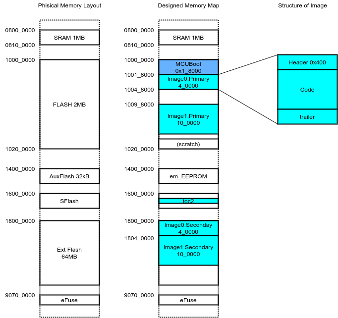

組込用Bootloaderのひとつとして[MCUBoot](https://mcuboot.com/)がある。いくつかのMCUやROTSがサポートしているが日本語の記事は少ない。以下はCypreessのModusToolBoxでサポートしているMCUBootを使ってみたまとめである。MCUBootを使ってみようと思う方の参考になれば幸いだ。


## MCUBootの機能

MCUBootはブートローダである。機能はアプリを起動すること。組込み（Non-OS）の場合、リセットハンドラから内蔵Flashの先頭アドレスにジャンプしてそこからアプリが起動することが一般的である。ブートローダを用いると、まずブートローダが起動して、ブートローダがアプリを起動する。あえてブートローダを利用する目的は次のようなものだ。

* OTA(Over The Air)などでファームウエアのアップロードをしたい。
* バージョンアップに失敗した時などのために一つ前のバージョンを起動したい。

こういった機能は自前で実装してもよいが出来合いのブートローダを利用することもできる。
また、アプリとブートローダを分ける理由は、アプリの更新を失敗したとして、ブートローダが生きていれば復帰の可能性が上がることなどがある。

そういった要望をサポートするためにMCUBootは次の機能がある。

* アプリを起動する。
* アプリをアップデートする。
* 複数のアプリの起動を切り替える。
* アプリの書名を検証する。

具体的にはMCUBootは次の動作を行う。

1. リセット直後、MCUBootが起動する。
2. MCUBootは内蔵Flash内のアプリの署名を検証し、正常ならそのアプリを起動する。アプリは複数の中から選択できるが、デフォルトはImage0と呼ばれるアプリが起動する。
3. なんらかのトリガーがあればImage1などの別のアプリを起動する。ここでいうトリガとはGPIO入力(起動時に特定のボタンを押している)など。MCUBoot自体はImageの数に制限はないが、PSoC6移植版はImage0とImage1の2つのアプリの起動に対応している。
4. それぞれのImage?には実行用のPrimary Imageとアップデート用のSecondary Imageがある。Primary Imageは通常内蔵Flashに配置され、署名チェック後にMCUから実行される。
5. Secondary Imageはアップデート用。MCUBootがSecondary Imageを検出すると、正常性を判定のうえ(署名、設定によってはバージョンが新しい、など)Primary Imageにコピーして、Primary Imageを起動する。
6. Secondary Imageは内蔵Flashまたは外付けFlashに配置される。

## より具体的な例

以下では次のような構成を考えよう。

とあるIoTデバイスの組込みアプリ。メインの機能はWi-Fiでサーバに接続してユーザにサービスを提供する。しかしデバイスには電源ボタンしかUIがないのでWiFiのアクセスポイントやサーバーアドレスの設定ははBlueToothで接続したスマホから行う。ご都合主義だが、電源ボタンを長押しした場合はBlueToothの設定アプリが起動し、電源ボタンを短押しした場合はWiFiのサービスアプリが起動する。モードを分けているのは、設定は管理者が行いユーザからは隠したいから。

ファームウエアをアップデートしたい場合はBluetoothやWi-Fiなどで更新ファームをダウンロードして外付けFlash領域に格納する（内蔵Flash領域はアプリで満杯なので）。ダウンロードしてきた新版が正常であればファームアップデートを実行する。

ここで、MCUBootの次の機能が利用される。

* 2つのアプリのどちらかを選択して起動する。
* アプリ（ファームウエア）をアップデートする。MCUBootは、アプリは内蔵Flashメモリに配置される。アップデートするアプリは内蔵Flashか外付けFlashにいったん格納し、そこからアップデートしなければならない。（ダウンロードしながら動作している自分自身を書き換えることはできない）。
* MCUBootの現在の制限だが、外付けFlashからアップデートする場合は、交換モード（いったん新版アプリと旧版アプリに交換して新版アプリを起動して、起動が成功したらその交換を永続化させる）は使えない。
* アップデートしたいアプリが正当なものであるか（壊れていないか、偽物でないか）を検証する。

## メモリマップ

MCUBootはシステム全体(bootloader自身、その上で実行されるアプリ2種類、それぞれのアプリのアップデート元のフラッシュ領域)でメモリマップを共有する。メモリマップは最も重要な設計である。今回想定しているのは次のとおり。

左の図が物理的なメモリとそれらが配置されているアドレス。それを中央の図のように割り当てたメモリマップを設計する。



### SRAM

今回の設計ではSRAMは、MCUBoot、Image0、Image1のそれぞれのプログラムで全領域を使えるようにする。つまり、他のアプリの存在を気にせずに、全SRAM領域を自分のためだけに使うことができる設計である。つまり以前に起動していたアプリのデータは破壊される。

もちろん、SRAMをセグメント分割して、アプリ切替時に保存される領域を作成し、データの受け渡しを行うような設計も可能だ。

### MCUBoot

内蔵フラッシュメモリの先頭にMCUBootの領域がある。ここにはMCUBootそのものが書き込まれ、ハードリセット直後に実行される。MCUBootはその機能のほとんどがライブラリ化されており、ライブラリを呼び出す`main`とライブラリがリンクされたものとなる。Cypress PSoC6はCortex-M0+とCortex-M4の2つのコアを持つがMCUBootはCortex-M0+で実行されるように作られる。そこから呼び出されるアプリは基本的にCortex-M4で実行される。

### Image0.primary

その後に、Image0.primaryと言う領域がある。これは、Image0というアプリの実行用の領域ということだ。それに対応するImage0.secondaryという領域が外付けFlash上にある。MCUBootはImage0.secondaryに書き込まれたイメージをImage0.primaryに上書きコピー（またはスワップ）してからImage0.primaryを実行する。primaryは実行速度の関係から（外付けFlash領域に実行権限があったとしても）内蔵Flashにおくことが望ましい。しかし、secondaryは内蔵Flashにあっても外付けFlashにあっても良い。今回の設計では内蔵Flashに入りきらないから外付けFlashに置いた。

リンク時に、通常のFlash先頭から実行されるように配置するのではなく、Image0.primaryの領域のさらにMCUBoot Image Header(0x400バイト)後の領域に配置されるように、リンカスクリプトを調整する必要がある。

イメージ領域の先頭にはImage Headerと呼ばれる0x400バイトの領域が、末尾にはtrilerと呼ばれる領域が付加される。

#### Header
```
 0                   1                   2                   3
 0 1 2 3 4 5 6 7 8 9 0 1 2 3 4 5 6 7 8 9 0 1 2 3 4 5 6 7 8 9 0 1
+-+-+-+-+-+-+-+-+-+-+-+-+-+-+-+-+-+-+-+-+-+-+-+-+-+-+-+-+-+-+-+-+
|                       MAGIC (8 octets)                        |
+-+-+-+-+-+-+-+-+-+-+-+-+-+-+-+-+-+-+-+-+-+-+-+-+-+-+-+-+-+-+-+-+
|                          load addr                            |
+-+-+-+-+-+-+-+-+-+-+-+-+-+-+-+-+-+-+-+-+-+-+-+-+-+-+-+-+-+-+-+-+
|   header size                 |           tlv size            |
+-+-+-+-+-+-+-+-+-+-+-+-+-+-+-+-+-+-+-+-+-+-+-+-+-+-+-+-+-+-+-+-+
|                img size (not include header)                  |
+-+-+-+-+-+-+-+-+-+-+-+-+-+-+-+-+-+-+-+-+-+-+-+-+-+-+-+-+-+-+-+-+
|                          img flag                             |
+-+-+-+-+-+-+-+-+-+-+-+-+-+-+-+-+-+-+-+-+-+-+-+-+-+-+-+-+-+-+-+-+
|   major       |   minor       |      version                  |
+-+-+-+-+-+-+-+-+-+-+-+-+-+-+-+-+-+-+-+-+-+-+-+-+-+-+-+-+-+-+-+-+
|                            build                              |
+-+-+-+-+-+-+-+-+-+-+-+-+-+-+-+-+-+-+-+-+-+-+-+-+-+-+-+-+-+-+-+-+
|                                                               |
+-+-+-+-+-+-+-+-+-+-+-+-+-+-+-+-+-+-+-+-+-+-+-+-+-+-+-+-+-+-+-+-+
```

#### trailer

```
 0                   1                   2                   3
 0 1 2 3 4 5 6 7 8 9 0 1 2 3 4 5 6 7 8 9 0 1 2 3 4 5 6 7 8 9 0 1
+-+-+-+-+-+-+-+-+-+-+-+-+-+-+-+-+-+-+-+-+-+-+-+-+-+-+-+-+-+-+-+-+
~                                                               ~
~    Swap status (BOOT_MAX_IMG_SECTORS * min-write-size * 3)    ~
~                                                               ~
+-+-+-+-+-+-+-+-+-+-+-+-+-+-+-+-+-+-+-+-+-+-+-+-+-+-+-+-+-+-+-+-+
|                 Encryption key 0 (16 octets) [*]              |
|                                                               |
+-+-+-+-+-+-+-+-+-+-+-+-+-+-+-+-+-+-+-+-+-+-+-+-+-+-+-+-+-+-+-+-+
|                 Encryption key 1 (16 octets) [*]              |
|                                                               |
+-+-+-+-+-+-+-+-+-+-+-+-+-+-+-+-+-+-+-+-+-+-+-+-+-+-+-+-+-+-+-+-+
|                      Swap size (4 octets)                     |
+-+-+-+-+-+-+-+-+-+-+-+-+-+-+-+-+-+-+-+-+-+-+-+-+-+-+-+-+-+-+-+-+
|   Swap info   |           0xff padding (7 octets)             |
+-+-+-+-+-+-+-+-+-+-+-+-+-+-+-+-+-+-+-+-+-+-+-+-+-+-+-+-+-+-+-+-+
|   Copy done   |           0xff padding (7 octets)             |
+-+-+-+-+-+-+-+-+-+-+-+-+-+-+-+-+-+-+-+-+-+-+-+-+-+-+-+-+-+-+-+-+
|   Image OK    |           0xff padding (7 octets)             |
+-+-+-+-+-+-+-+-+-+-+-+-+-+-+-+-+-+-+-+-+-+-+-+-+-+-+-+-+-+-+-+-+
|                       MAGIC (16 octets)                       |
|                                                               |
+-+-+-+-+-+-+-+-+-+-+-+-+-+-+-+-+-+-+-+-+-+-+-+-+-+-+-+-+-+-+-+-+
```


### Image1.primary

さらにImage1.primary, Image1.secondaryという領域が、同様に内蔵Flashと外付けFlashに割り当てる。MCUBootの機能として複数のImage?を選択して起動することが出来る。デフォルトではImage0を起動できるがそれ以外のImageの起動も可能だ。ただし、Cypress移植版ではImage0とImage1の2つのうちいずれかしか起動できない。

### dummy

ここで、Image0.primaryとImage1.primaryの間が0x4_0000だけ空いている。理由はよくわからないが、Image0.secondaryをImage0.primaryのすぐ後に配置する時のためのダミーとして、サンプルでは空けてあるようだ。現在のところ、ここを使用しなくても内蔵Flashメモリに余裕があるので踏襲している。

### scratch

今回は、外付けメモリからの更新のためsecondaryからprimaryのコピーを上書きとしたが、上書きではなくスワップとすることもできる。その場合は内蔵Flashの末尾におかれたscratch領域がそのスワップのためのバッファとして使われる（今回は設けていない）。

`Image*`領域よりも少ない領域がバッファとして使われるので、その分、書き換え頻度は`Image*`領域よりも増える。FWアップデートの想定回数から計算されるscratchの書き換え回数は、内蔵Flashの書き換え限度に対して十分（100倍程度）な回数に薄まるような領域サイズの指定が必要となる。

MCUBootの機能では、さらに、スワップして起動に成功すればスワップを永続化し、起動に失敗すれば再度スワップして古いバージョンを起動する、ということも可能だ。

### toc_2

PSoCに特有の事情なのだがSFlash上にある`toc_2`という領域に外付けFlashの情報を書き込むことによって、SWD経由でその情報を参照して外付けFlashに書き込むことができる。外付けFlashの情報を`bootloader_cm0p`つまりMCUBootのブートローダの部分にリンクし、それをSWDで書き込むことにより、リンカファイルで指定されたアドレスに`toc_2`の情報が書き込まれる。それ以降、外付けFlashのアドレスを指定されたHEXファイルも、`toc_2`の情報を参照してSWD経由で書き込むことが可能になる。

### em_EEPROM

PSoCにはem_EEPROMというライブラリがある。通常、Flashメモリはブロック単位の消去が必要だが EEPROM はバイト単位の書き換えが可能な不揮発性メモリとして理解される。設定値などを永続的に保存しておきたい時のために、em_EEPROMというライブラリが提供されてい。記憶領域をしてはFlashメモリを利用するが、バイト単位に書き換え可能なようにラップして、容易に扱うことができるようになっている。

em_EEPROMライブラリ自体は、どのFlash領域も元ネタとして扱うことができる。PSoC6にはAuxFlashというそれに適した領域が用意されているので、リンカスクリプトを工夫して、AuxFlashの領域をem_EEPROM用の記憶域として割り当てることが多い。

一般的な手順でコンパイルする時、em_EEPROMの記憶域を内蔵Flashに割り当てた場合、それはImage0.primaryの領域内にある。この領域は署名されていてブート時にMCUBootによって署名検証がなされる。つまりem_EEPROM領域の不揮発変数を書き換えた場合、署名検証に失敗して起動しない。

そのような理由やImage0のアップデートでも不揮発変数内容を保存したいという理由により、em_EEPROMのリソースをAuxFlash領域に割り当てる。この場合、ビルド後のHEXファイルは、Image0.primaryのアドレスの他に、em_EEPROM用の記憶域が割り当てられたAuxFlashのアドレスも含む。Cypressから提供されているビルドスクリプトでは`POSTBUILD`コマンドで、AuxFlashも含んだ全HEXファイルに対して署名を試みる。しかしこれはImage0.primaryの領域をはみ出しているので失敗する。しかたがないので、自作スクリプトでビルドしてできたHEXファイルからAuxFlashの領域を取り除いたHEXファイルを生成し、それに対して署名させるようにする。みんな困っていると思うのだが、MCUBootプロジェクトからもCypressからも、現時点ではこのようなスクリプトは提供されていない（これぐらい対処できないヤツは想定ユーザではないということだろう）。

### Image0.secondary

アップデート用のファームウエアはSecondary領域に書き込まれ、MCUBootによって本来あるべきPrimary領域にコピーされてから実行される。当然、領域のサイズはImage0.primaryと等しくなくてはならない。

Secondary領域に書き込むHEXファイルは、Primary領域用にビルドされてアドレス解決されているが、HEXファイル上で指定されているアドレスがシフトされているのでSecondary領域に書き込まれる。このようなHEXファイルを作成するためには、Primaryと同じようにビルドして（まずはELFファイルが作成される）、`objcopy`を使ってアドレスを書き込み用にシフトしたHEXファイルを作成する。`OpenOCD`などのツールで、そのHEXファイルを書き込むと、HEXファイルに指定されたアドレス通りに、Secondaryの領域に書き込まれる。それが外付けFlashにある場合は上述の`toc_2`によってSWD経由で書き込むことも可能だ。もちろん、SWDを使わずにOTAでアプリからこの領域に書き込むことも可能だ。その場合は`toc_2`の仕組みは不要。

このように書き込み時のアドレスシフトを行うためにも、書き込み用HEXファイルにはAuxFlash領域(em_EEPROM)が含まれていないことが必要だ。

MCUBootの設定によって、Image Header中に含まれるバージョン情報を比較して、新しい場合にsecondary⇒primaryのコピーを実施するようにすることも可能だ。

### Image1.secondary

Image0.secondaryと同様。


## MCUBootの構成方法

実際には、ModusToolBoxの`project-creator`で`MCUBoot-Based_Basic_Bootloader`というサンプルプログラムを試して、そこから拡張していくのが楽だろう。このサンプルプログラムは次の流れだ。

1. プロジェクトを作成すると、`bootloader_cm0p`というブートローダ、`blinky_cm4`というアプリの2つのサブプロジェクトが含まれる。
2. `bootloader_cm0p`は、その名のとおりCortex-M0+コアで実行されるブートローダ。それが`blinky_cm4`というCortex-M4で実行されるLチカアプリをロードして実行する。
3. まずは`bootloader_cm0p`をビルドして書き込む。この時点ではアプリはまだない。
4. `blinky_m4`はビルド時のオプションで、V1.0.0 と V2.0.0を作り分けることができる。最初に V1.0.0を作成しImage0.primaryに書き込んでブートローダから起動する。
5. `blinky_m4`をV2.0.0でビルドする。これを書き込むとImage0.secondary領域に書き込まれる。初期設定では、Image0.secondaryはFlash上のImage0.primaryのすぐ後に配置される。再起動すると署名を検証してsecondary⇒primaryのコピーを行い、primaryにコピーされたV2.0.0アプリが起動する。

これを改造して、冒頭に書いた要求されている動作を行う。

[メモリマップ](#メモリマップ)の節と説明が重複したり前後するがここではMCUBootの実装・実行時の視点から解説を行う。


### `imgtool.py`

イメージの署名などで使われる`imgtool.py`はその名のとおりPythonスクリプトなので、Pythonが動く環境で次のセットアップが必要。

```
python -m pip install -r requirements.txt
```

`requirements.txt`の内容は次のとおり。`[click](https://click.palletsprojects.com/en/7.x/)`はコマンドラインパーサ、`cbor`はバイナリエンコーダ。

```
cryptgraphy>=2.6
intelhex
click
cbor>=1.0.0
```

### Slot ID

MCUBootは個々のメモリ領域を次のIDで取り扱う。番号が直感的でなく時々迷うので注意。`4`は何処？

```c
#define FLASH_AREA_BOOTLOADER         0             // MCUBoot自体が格納されている領域
#define FLASH_AREA_IMAGE_SCRATCH      3             // Image Swapのためのscratch領域
#define FLASH_AREA_IMAGE_PRIMARY      1             // Image0.primary 実行用
#define FLASH_AREA_IMAGE_SECONDARY    2             // Image0.secondary アップデート時にこの領域からprimaryにコピーされる
#define FLASH_AREA_IMAGE_PRIMARY      5             // Image1.primary 実行用
#define FLASH_AREA_IMAGE_SECONDARY    6             // Image1.secondary アップデート時にこの領域からprimaryにコピーされる
```

### bootloader_cm0p

上述のようにMCUBoot自体はCortex-M0+コアで実行される。CypressのModusToolBox環境ではMakefileが工夫されている（黒魔術）。基本的な設定はMakefileを通して行い、それがリンカスクリプトやCコード中の#defineに反映されるようになっている。Makefileもメモリマップも `bootloader_cm0p/shared_config.mk`で定義されたものがそれぞれのアプリにシェアされる。

### `cy_serial_flash_prog.c`

上述のとおり、今回の実装例では、外付けFlashにアプリをいったんアップロードしてMCUBootがそれを実行領域にコピーして実行される。

では、その外付けFlashにプログラムを書き込む方法は？

実環境ではOTAを使うのでWiFiかBluetooth経由でダウンロードされるのだろう。しかしデバッグ環境ではSWD経由で書き込みたい。

PSoCでは外付けシリアルフラッシュに`toc2`という仕組みを用いてOpenOCDを用いてSWD経由で書き込むことができる。これはSFDP(Serial FLASH Discoverable Parameters)というFlashメモリの標準化された書き込みパラメータをSMIF PDLというCypress製のAPIで利用することにより実行される。

1. ModusToolBoxの中に`qspi-configurator`というツールがあり、それで外付けFlashの設定を行う。`qspi_config.cyqspi`というファイルにその内容が書き込まれる。
2. `cycfg_qspi_memslot.c|h`, `cy_serial_flash_prog.c`というファイルが生成されるのでそれをビルドしてリンクする。`cycfg_qspi_memslot.c|h`はフラッシュメモリ自体の構造や書き込みコマンドなどがコード化されている。`cy_serial_flash_prog.c`は、Cコード中のセグメント指定とリンカでの指定により、必要な情報が、PSoCの内蔵FlashのSFlash領域の`.sflash_toc_2`セグメントに配置される。
3. 書き込みツールはこのメモリ情報を読みだして、外付けFlashへの書き込み方法を読み取り、それに基づいて書き込む。TOCはTable of Contentのこと。

### `main.c`

MCUBoot自体はほとんどがライブラリ化されているので、`main()`自体は簡単。概略次のとおり。

```c
void main()
{
    struct boot_rsp rsp;
    
    /* 初期化 */

    if (boot_go(&rsp) == 0) {
        do_boot(&rsp);
    }
}
```
`boot_go()`が本体。`rsp`構造体を構築し、署名検証、primary領域へのコピーなどを行い実行すべきアプリのアドレスをセットする。

`do_boot()`は`rsp`構造体の中の指定されたアドレスに対して`Cy_SysEnableCM4()`を呼んでアプリの実行を開始するだけ。

```c
static void do_boot(struct boot_rsp *rsp)
{
    uint32_t app_addr = (rsp->br_image_off + rsp->br_hdr->ih_hdr_size);

    BOOT_LOG_INF("Starting User Application on CM4. Please wait...");
    Cy_SysLib_Delay(CM4_BOOT_DELAY_MS);
    Cy_SysEnableCM4(app_addr);

    while (true)
    {
        __WFI();
    }
}
```

Image0とImage1を切り替えたい場合は`do_boot()`の実行前に`rsp`構造体の中のアドレスをいじる。

```c
        if (Cy_GPIP_Read(GPIO_POT1, 4) == 0) {      // P1.4に繋がっているスイッチが押されてLが入力された時
            rsp.br_image_off = 0x10098000;          // Image1.primaryのアドレス
        }
```

### 署名鍵

上述のようにMCUBootはイメージの署名検証機能がある。公開鍵は`imgtool.py`の機能によってCの配列にエンコードされ、MCUBootのビルド時に`#include`される。秘密鍵は`shared_config.mk`経由でアプリビルド時に`imgtool.py`を用いてHEXファイルを署名するのに使われる。

### `Makefile`

黒魔術っぽい`Makefile`だが特徴的なところ。

* アプリも含めたシステム全体にかかわるものは`shared_condif.mk`として分離されている。
* 外付けFlashを利用している場合は`PREBUILD`で`qspi-configurator-cli`を実行し、`*.cyqspi`ファイルから`cy_serial_flash_prog.c`を生成する。
* `Makefile`で定義された変数をリンカに渡すために`--defsym=....`オプションを使っている。そのせいで、このデモはGCC ARM(gcc ld)が必要となっている。おそらく、IARやARM CCでは実行できない。しかし、いずれのコンパイラもオブジェクトファイルのフォーマットはELFなので、リンカだけgcc ldを使えばこのオプションを利用してリンクすることができるのでは（未確認）？


## Image0

此処から先は、MCUBootから起動されるアプリの作り方の話。

初期のでもプロジェクトでは、Image0だけ（Image1は無し）で、内蔵Flashからのアップデート。しかし、実現したいのはImage0とImage1の起動（これは上で達成）と外付けFlashからのアップデート。

Cのコード自体は普通に（ブートローダを意識せずに）書けばよい。

ただし、上述のように、em_EEPROMを使う場合には、em_EEPROMのデータ領域をメインのコード用FlashではなくAuxFlashに割り当てるようにしなければならない。コード用Flashにem_EEPROMを割り当てた場合、内容を変更すると次回起動時に署名検証エラーとなる。

```c
CY_SECTION(".cy_em_eeprom")
CY_ALIGN(CY_EM_EEPROM_FLASH_SIZEOF_ROW)
const uint8_t emEepromStorage[CY_EM_EEPROM_GET_PHYSICAL_SIZE(DATA_SIZE, SIMPLE_MODE, WEAR_LEVELING, REDUNDANT_COPY)] = {0u};
```

### リンカ

設計どおりのアドレスから配置するようにリンカスクリプトを設定する。ただし、実際に`.text`セグメントが配置されるのは`MCUBOOT_HEADER_SIZE`(=0x400)バイト後から。

上述のとおりemEEPROMを使う場合は、セグメント`.cy_em_eeprom`もAuxFlushに配置されるようにリンカスクリプトを細工しておく。

### Makefile

* `bootloader_cm0p`のディレクトリから共有設定(shared_config.mk、鍵ファイルなど)を読み込む。
* 通常通りビルドして、リンカで実行イメージをImage0.primaryに配置する。

ここからは`Makefile`中の`POSTBUILD`で指定されているコマンド。
```
IMGTOOL_PATH=../bootloader_cm0p/libs/mcuboot/scripts/imgtool.py
CY_BUILD_VERSION=$(APP_VERSION_MAJOR).$(APP_VERSION_MINOR).$(APP_VERSION_BUILD)
SIGN_ARGS=sign --header-size $(MCUBOOT_HEADER_SIZE) --pad-header --align 8 -v $(CY_BUILD_VERSION) \
               -S $(MCUBOOT_SLOT_SIZE) -M $(MCUBOOT_MAX_IMG_SECTORS) --overwrite-only -R $(ERASED_VALUE) -k $(KEY_FILE_PATH)/$(SIGN_KEY_FILE).pem

POSTBUILD=\
cp -f $(BINARY_OUT_PATH).hex $(BINARY_OUT_PATH)_raw.hex;\
rm -f $(BINARY_OUT_PATH).hex;\
$(CY_ELF_TO_HEX_TOOL) --change-addresses=$(HEADER_OFFSET) $(CY_ELF_TO_HEX_OPTIONS) $(BINARY_OUT_PATH).elf $(BINARY_OUT_PATH)_unsigned.hex; \
cat $(BINARY_OUT_PATH)_unsigned.hex | $(PYTHON_PATH) remove_eeprom.py > ttt.hex ;\
mv ttt.hex $(BINARY_OUT_PATH)_unsigned.hex; \
$(PYTHON_PATH) $(IMGTOOL_PATH) $(SIGN_ARGS) $(BINARY_OUT_PATH)_unsigned.hex $(BINARY_OUT_PATH).hex;
```

* `arm-none-eabi-objcopy`（`$CY_ELF_TO_HEX_TOOL`という変数に代入されている）でELFからHEXを生成する。
    + その時に、secondary用の場合は`--change-address=$HEADER_OFFSET`アドレス変換を行う。
    + `$HEADER_OFFSET`の値はImage0.primaryからImage0.secondaryの差で0x1800_0000-0x1001_8000=0x07fe_8000。（アドレス詳細は上の[メモリマップ](#メモリマップ)を参照）
* `remove_eeprom.py`という簡単な自作ツール（下）でAuxFlushのアドレス範囲をHEXファイルから削除する。
* `imgtool.py`を用いて署名を行う。このとき、ヘッダ中にバージョンを埋め込むことができる。    

```python
#!env python
import fileinput
passmode=True
for line in fileinput.input():
    if passmode==True:
        if line.startwith(":020000041400E6"):
            passmode=False
        elif line.startwith(":020000041BFAE5"):
            passmode=False
        else:
            print(line, end="")
    else:
        if line.startwith(":04000005"):
            passmode=True
            print(line, end="")
```

`:02`はアドレス指定、`0000`はダミー、その次の`04`はアドレスサイズ。`1400`はアドレスの上位。これがAuxFlash領域を指している。最後の`E6`はチェックサム。このアドレスが来た場合は以後出力しない。

secondaryイメージの場合はAuxFlushのアドレスも`$HEADER_OFFSET`だけシフトされているのでそれに対応する条件も付いている。secondaryの場合は`HEADER_OFFSET`=0x1804_0000-0x1009_8000=0x07fe_8000なので、AuxFlashの0x1400_0000は0x1400_0000+0x07fe_8000=0x1BFE_8000から始まっているように見える。

`:04....`は拡張アドレス指定で、別のアドレスブロックが始まることを示している。

ModusToolBoxの標準のMakefileのオプションを利用する場合、Primary Imageは次のように実行すればOpenOCDによる書き込みまで行ってくれる。

```
make program -j
```

Secondary Imageの場合は次のようにオプションを付ける。

```
make program -j USE_EXT_FLASH=1 IMG_TYPE=UPGRADE MEADER_OFFSET=0x07fe8000
```

## Secondary Imageの書き込み方法

上のように`make program`コマンドを用いればOpenOCDによってSWD経由で書き込むことができる。

ここでは、`Image0`のプログラムがBLE経由でスマホから新版ファームウエアをダウンロードできるようにしてみよう。

MCUBootを使っている場合、とにかくSecondary領域に署名付きイメージを書き込めば、あとはMCUBootがprimary領域にコピーしてくれる。

### OTA

Secondaryイメージを書き込む時に作成されるHEXファイルの内容を、何らかの方法（BluetoothでもTCP/IP over WiFiでもよい）で稼働しているファームウエアに渡し、そのファームウエアがHEXファイルに指定されているアドレス（外付けFlash）に書き込み、再起動すれば、MCUBootがファームアップデートをしてくれるのでOTAが実現できる。外付けFlashを取り扱うためには`serial_flash`ライブラリが提供されているので、`make modlibs`して`configuration-manager`を呼び出して、`serial_flash`をプロジェクトに付加すればよい。

### ファームウエアからの外付けFlashの取り扱い

上と同様に、`qspi-configurator`を使ってコード生成を行うが、そこで生成される`cycfg_qspi_memslot.c|h`が、プログラムから外付けFlashを取り扱う時に必要なパラメータが保存されている。あとは、serial_flashが提供するAPIを用いてプログラムすればよい。

サンプルプログラム⇒[https://github.com/cypresssemiconductorco/mtb-example-psoc6-qspi-readwrite/blob/master/main.c](https://github.com/cypresssemiconductorco/mtb-example-psoc6-qspi-readwrite/blob/master/main.c)

ただし、ときどきReadError、WriteErrorが発生する。ベリファイと復帰はきちんとしておいたほうがいい。

